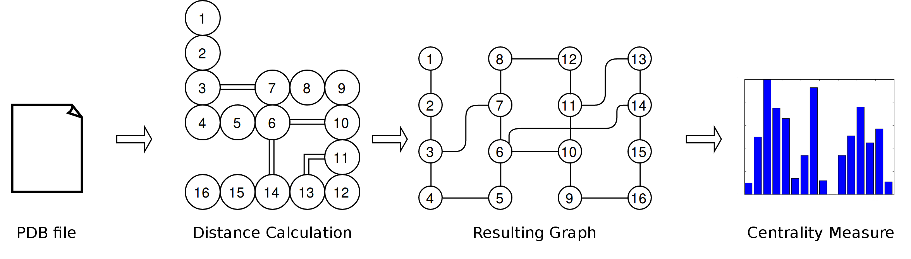

# ProteinStructureNetworks

Undergrad work developed by Bruno Daiki Yamada under Prof. Dr. Sandro Roberto Marana advisory.

## Rationale

Life as we know it depends on small molecular machines called proteins. Unraveling its secrets
is to understand life itself. To study such minuscule machines, researchers employ advanced
scientific methods to determine it's structure, such as Nuclear Magnetic Resonance or X-Ray
diffraction. However, even if one can perfectly reveal the shape of a protein, the mechanism
behind it may still be a mystery.

A common approach to find the amino acid residues responsible for the protein function is to
make single mutations on it's structure, usually swapping a possibly important part of its 
chain with another amino acid. If the protein's function is compromised, it is clear evidence
of its importance to protein function. However, the number of residues in a protein can easily 
surpass hundreds of residues, while making such assessment is *very* time consuming and expensive.
How can we optimize our efforts in this field?



The answer is with network and computer science. We can transform the protein structure into a 
computer-friendly graph representation and apply basic algorithms to measure the importance
of a amino acid residue based on the connections on the network. Each element of the network is 
a amino acid residue, and each connection represents physical proximity within the tertiary 
structure of the protein. Now, using **centrality algorithyms**, which are algorithms developed
to measure the importance of a element to the network, we can predict the importance of a
residue by using the centrality within the protein structure network.

Such process can easily be done with Cytoscape software, which is a program designed for such
tasks involving network science. However, we wish to analyze hundreds of protein structures
from a molecular dynamics simulation without having to feed it manually to the software and 
have a simple way to have all centralities in a time series. Therefore we developed simple
Python scripts from scratch to do this process.

You can check out a more thorough explanation <a href="https://bruno153.github.io/2019/08/20/IC1.html">here</a>

## How to use

**Disclaimer:** These scripts are not exactly easy to use and also not very efficient. Pardon
my inexperience as a undergrad. Also, this is a postmortem documentation, so maybe I may
somewhat inaccurately describe its use.

**You need Python 2.7 for these files**

This process receives a `.pdb` file with single or multiple protein structures and outputs
a single file containing the centrality measure of all amino acid residues along multiple
structures.

For each centrality measure (betweenness, closeness and eigenvector) there's a designated
script with its name. eg. `ProteinBetweenness.py` receives a `pdb` file and calculates
all centralities.

The `ProteinCENTRALITY.py` scripts depend on `Graph.py`, which contains all centrality measure
algorithms and graph as objects. The `Graph.py` does also depend on `Point.py` script, which is 
designed to calculate distance in three-dimensional space. It's a bit convoluted for something 
simple, I know.

You may execute the `ProteinCENTRALITY.py` like in the following example:

``` 
python ProteinBetweenness.py
Insert file name:
4dc2_no_substrate
Done Model
Done LOL
```

These scripts take no arguments and you may input the name of the files without the file extension
(it is assumed to be `.pdb`) in the command prompt itself. 

Other scripts are used to plot all the data from centrality measures, such as histograms or
variation of centrality within time.

## Support

This undergrad research developed on Instituto de Química - Universidade de São Paulo, and was funded by FAPESP.

